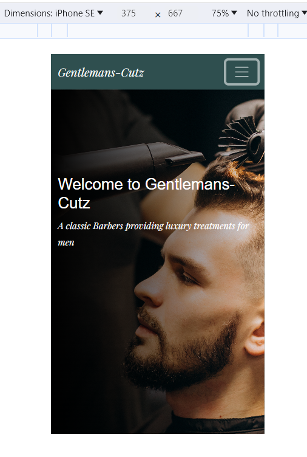
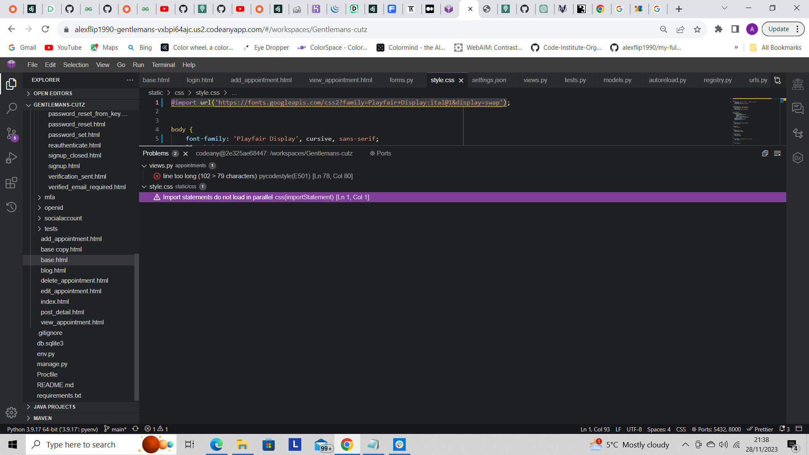

# Project 4: Gentlemans-Cutz barber booking system

Unfortunately Am I Responsive could not connect to Heroku at the time,I had spoken to tutor assist who recomended doing screen shots of the website
on different devices which I have included below

## Introduction

 This website Gentlemanz-Cutz is a fictional barbershop website where users have the ability to create an account, sign in, make an appointment and view, edit or delete their appointments that they have made, view the blog post section and comment on the blog posts. Only users who have registered to the site will be able to book an appointment or comment on a blog post.  Admin users also have the ability to create,edit and delete appointments created by themselves or appointments created by users as well as any comments via the blog posts.
 [View Live website here](https://gentlemans-cutz-f278215e50b9.herokuapp.com/)

## User Experience

### User stories

- As a first time user, I want to be able to understand the purpose of the website.
- As a first time user, I want the navigation of the site to be clear and easy to follow.
- As a first time user, I want to be able to create an account so I am able to access the appointments page and other content.
- As a first time user, I want to be able to create an appointment, view my appointments and make changes to them if necessary.
- As a first time user, I want to be able to view updated blog posts like and comment on the post.
- As a first time user, I want to be able to sign out of my account and have my account details and appointments made stored safely.
  
### Returning users

- As a returning user, I want to be able to sign into my account that I previously created.
- As a returning user, I want to be able to create a new appointment and view my previous appointments booked and have the ability to edit/delete any appointment I have made.
- As a returning user, I want to be able to view other users comments and like them on any blog post created.
- As a returning user, I want to be able to sign out of my account and have my account details and appointments made stored safely.

## Layout

### Design

- The color used for the header,background and footer of the website is dark slate gray.

### Typography

- Standard bootstrap theme for all the components and styling was used. Playfair is the main font used throughout the site, colored white with styled as italic, Dela Gothic one was the original font for the h1 element however looks visually better as sans-serif.

### Images

- Background image was chosen to go with the websites theme. I have chosen a male having his hair cut and the image has had the liner gradient effect added to make it darker on the left side fading lighter to the right, this gives the image a calmer tone and goes well with the other colors chosen for the site.

## Wireframes

- I decided to use a standard bootstrap theme for this project which helped me save some time creating the project. I followed the theme layout and customized labels for the forms, so no original wireframes were used. From using bootstrap the website is fully responsive on all screen sizes so no adjustments had to be made to suit smaller or larger screens.

## Languages used

- HTML5
- CSS
- Python

## Programs, Libraries and frameworks

- Bootstrap 5.0.1 - This was used for the responsiveness and structure of the website

- Django - The Django framework was used to create the database, model,functionality and structure of the website using Python code.

- Google fonts - This was used to select the Playfair font used in the project.

- Font awesome - This was used to select the icons used on the website to take users to social media links.

- Github - This was used to host the repository and store the commit history.

- Heroku - This is the platform that the application is deployed to.

- Lighthouse - This was used to test the websites performance.

- Cloudinary  - This was installed for cloud based storage and for any potential images used.

- PostgreSQL - This was used for Django's database system.

- Gunicorn - Server used to run Django on heroku.

- Summernote - a JavaScript library that helps you create WYSIWYG editors online.

## Features

- Gentlemans-Cutz website styling has been kept minimal this is so the user is not overwhelmed when viewing the website, upon arrival the user is greeted with a very simple home page  with the navigation bar displayed to the top right of the screen.

- The user is able to view the blog page from this window without having to sign up or log in however they will not be able to interact with the blog post until they register or log in

 
 

- If this is a first time user they can register to the website by clicking the register link in the navigation bar. They will be required to fill in the fields stated and then register to the website.

- If this is a returning user they can access their account by clicking on the login link in the navigation bar, they will be required to enter their username and password to log in.

- Once the user has created an account or logged in as a returning customer they will be redirected back to the homepage, the navigation bar now has an different feature called Appointments.

- If the user clicks the appointments link in the navigation bar they will be redirected to the appointments form where they will need to complete the following fields including their name, service they would like from clicking on the service which will provide a drop-down list of services available, they will need to enter the date they would like and select a time for their appointment, this works the same as the service options, clicking on the time will reveal a drop-down of times available. Note if the date and time has already been chosen by another user the form will reset, this is not a final feature I would like but due to time constraints I have not been able to implement this feature yet.

- Once the user has successfully submitted their form they will be redirected to view their appointment details where they will have the options to edit or delete their appointments.

- If the user chooses to edit their appointment they will be redirected to this page where they are able to make changes to their appointment and resubmit the form. This will redirect them back to the view appointments page.

- If the user chooses to deleted their appointment they will be redirected to this page and asked if they would like to confirm deleting their appointment. If the user chooses to delete their appointment they will be redirected back to the appointments form page.

- Should the user wish to view the blog post section once logged in they will now see they are able to submit a comment and like posts by clicking on the heart icon.

- When the user decideds to sign out they will be redirected to the sign-out page where they will be asked if their sure they would like to sign out.

## Features left to add

- In the near future I would like to add another link to the navigation bar to view existing appointments as this will be more user friendly and the user would not have to create a new appointment to view their old appointment.
- I would like to implement the JavaScript code needed to make the success messages work, this will be a nice finish and will help the user know when their appointments have been made or if they have chosen one thats not available.
- I would like to add more styling to the blog section, as this was not the main part of my project I focused more on other areas but I would still like to improve this area and make it more visually appealing.

## Testing

- W3C HTML Validator  

- W3C CSS Validator

- PEP8 Validator

- LIGHTHOUSE PERFORMANCE

## Testing user stories from User Experience

- As a first time user, I want to be able to understand the purpose of the website.
  - Once the website has loaded the user is greeted with a simple homepage with the hero image showing along with the header of the page Gentlemans-Cutz, there is a greeting heading with a sentence explaining what the websites purpose is.

- As a first time user, I want the navigation of the site to be clear and easy to follow.
  - On the homepage the user will be able to see the navigation bar towards the top right hand corner of the page, there are four options, Home, Blog, Register and login.

- As a first time user, I want to be able to create an account so I am able to access the appointments page and other content.
  - If the user clicks the log-in link they are greeted with a sign in message "Welcome to Gentlemans-Cutz if you would like to book an appointment or comment on our blog post, please log in. If you have not created an account yet, then sign up first" this message makes it clear to the user that to book an appointment or comment on the blog they will need to sign up to the website first. They will be prompted to create a username or optionally an email a password and re-entering their password.

- As a first time user, I want to be able to create an appointment, view my appointments and make changes to them if necessary.
  - Once the user has created an account or logged in they will see that the navigation bar to the top right of the screen has now changed to Home, Blog, Appointments and log out, if the user clicks on the appointment link they are then taken to the appointments form page where they are required to complete their details such as name, the service they would like ( there is a drop down menu of the services available when selected) they will need to enter the date they would like the appointment manually and select a time from the options available. Once the user has submitted their form they will be redirected to the view appointments page where they will be able to see their appointment details. To the right of side of the appointment details the user will have see an edit button, if selected the user is taken to the edit appointments page were they can make changes to their appointment and then save the new changes, this will redirect back to the view appointments page. If the user selects the delete button they will be redirected to the delete appointments page where they are asked if they are sure they would like to delete their appointment with a button to press that will delete the appointment for the user and if pressed will redirect them back to the appointments form page.

- As a first time user, I want to be able to view updated blog posts like and comment on the post.
  - If the user selects the blog link they will be redirected to the blog section where the user can see posts created by the employees, so long as the user has created an account with the site or has logged in they will be able to comment on the post by filling in the field towards the bottom right hand corner of the page with their comment and then clicking the submit button, once this is done it will let the user know that their comment has been submitted for approval.

- As a first time user, I want to be able to sign out of my account and have my account details and appointments made stored safely.
  - If the user wishes to log out they will need to select the logout link in the navigation bar, this will redirect them to the log out page where they are asked " are you sure you want to sign out?" once the sign-out button as been selected the user is then redirected back to the home page where the navigation bar has reverted back to Home,Blog,Register and Login.

- As a returning user, I want to be able to sign into my account that I previously created.
  - User needs to click on the login link in the navigation bar on the homepage, this will redirect them to the login section. The user will then need to enter their username and password and then click the sign in button. I login is successful the page will reload back to the homepage and the navigation bar will show as Home,Blog,Appointments and logout. If the user enters and incorrect user name or password and clicks sign in the page refreshes back to the login page with a message "The username and/or password you specified are not correct."

- As a returning user, I want to be able to create a new appointment and view my previous appointments booked and have the ability to edit/delete any appointment I have made.
  - User can create a new appointment once logged in by clicking the appointments link in the navigation bar this will redirect them to the appointments form page where they will need to complete the form as mentioned in the first time user story, once the form is submitted they will be redirected to the view appointments page where they will see all the appointments they have made and they will be able to edit or delete any of their appointments.

- As a returning user, I want to be able to view other users comments and like them on any blog post created.
  - User can view any comments made by other users and like the comments by clicking on the heart icon.

- As a returning user, I want to be able to sign out of my account and have my account details and appointments made stored safely.
  - User should follow the steps explained in the first time user stories.

## Testing user stories from admin panel

- As a  Site Admin I can create, read, update and delete posts so that I can manage my blog content
  - To access the admin panel firstly you will need to create a new superuser by typing python3 manage.py createsuperuser, you will then be prompted to create a username,email and password. Once these steps have been completed the superuser is created and you can access the admin panel by adding /admin to the basic web address. In the admin panel you can access the comments and post under the blog section to the left of the screen, to approve/update or delete comments you need to click the check box next to the comment and then click the drop down arrow in the action box select which option you would like to do and then click go, if this is to approve a comment on 'go' is clicked the comment will then show on the blog post, if you select delete you will be asked if your sure you would like to delete the comment and if yes is selected the comment will be deleted and will not be approved or show on the blog.
  - To create a blog post the admin user will need to click the + sign next to post this will take them to the add post section where they will need to fill in choose a title, select the author from the drop down menu, add the content, select the status from draft or post and click save, if the status is selected as post, this will post the the blog to the websites blog page.

- As a Site/Admin user I can create/delete/edit appointments so that I can manage the appointments.
  - To create/edit/delete appointments the user will need to log in as staff first, they then need to click the appointments tab on the left of the screen they can then add an appointment by selecting add, they will need to input the users name, service they would like, date and time and then click save, this will then save the appointment. If the Admin user wants to edit or delete the appointment they will need to click on the users name this will then take them to the appointments details where they can edit the service, date and time and click save to update the changes or if they choose to delete the appointment there is a delete button that will ask if you are sure you would like to delete the appointment when selected and if the admin user chooses yes then the appointment is deleted.

## Further testing

- Gentlemans-Cutz has been tested on Google-Chrome, FireFox and Microsoft Edge and works fine.
- The website has been tested on a number on different screens including Iphone XR, Samsung Galaxy S20 and Nest Hub Max, it is responsive and works on all devices however there is an issue with the background image not fully covering the view_appointments screen on devices Iphone SE, Galaxy Fold and Galaxy S8. Due to time restraints I have not been able so resolve this small issue yet but will something I will do in the future.
- Friends have been asked to review the site for any bugs or issues as a user experience.

## Bugs

Solved bugs

- Whilst in production I had bug within my code where if the user submitted an appointments form it was not saving to the database and showing in the admin panel after many hours of searching I had noticed the issue which was in the models.py file on line 33 I had this line of code
  - date = models.DateField(default=datetime.now)
  whilst in the views.py file throughout the functions I had stated day instead of date. Once this had been amended the code work correctly and was saving to the database.

- Whilst in production I had issues with rendering the form table in the edit/delete_appointments html folders, this was because I had the {{form|crispy}} below the  in both templates, this was spotted by my tutor Lauren and once I made the change the forms rendered correctly.

Whilst checking my code in the html validator there were a number of errors showing, Oisin from tutor support helped identify the issue which was I had an extra </table tag in the code which caused all these errors to show in the validator

## Unfixed bugs

- As mentioned previously there is a small issue with the view_appointments html page on three devices, this will be rectified in the near future.

- There is an issue with the users comments not showing on the blog page and due to time constraints from codeanywhere platform being down for maintenance and working 12hr shifts I have not yet been able to resolve this issue, however this will be something I will resolve in the near future.

- There is an issue with the message.success not showing this is because I have not been able to implement the JavaScript code needed for these to work due to time constraints, however this will be something that is implemented in the near future.

- There is one line of code that is too long line 78 in appointments views py file  I have tried to amend the code to make it shorter using parenthesis () however it broke the code so this is something i will resolve in the near future.

- I am aware that there is a warning message in the terminal "Import statements do not load in parallel" but as this is not classed as an error this will be amended in the near future when I am able to.

- I am not aware of any further unfixed bugs within the code.  

## Deployment

- The project was deployed to Heroku please follow these steps below to deploy
- Log into Github.
- Navigate to Code Institute full template repository .
- Click use this template and select create new repo.
- Create repo name and create repo from the template.
- Log into Codeanywhere with github account.
- Click new workspace.
- Paste URL from github and create workspace.

### Create an empty Django Project

In the terminal of your new work space you will need to install the following.

- pip3 install 'django<4' gunicorn.
- pip3 install dj_database_url==0.5.0 psycopg2.
- pip3 install dj3-cloudinary-storage.
- pip3 freeze --local > requirements.txt
- django - admin startproject PROJECT_NAME to create new project.
- python3 manage.py startapp APP_NAME to create new app.
- python3 manage.py makemigrations.
- migrate the changes to the database by typing python3 manage.py migrate

### Creating Heroku App

- Log into Heroku or create a new account if necessary.
- Click button labeled new to create a new app.
- Give your app a relative name and choose your region and click create app.

### Connecting PostgreSQL database through ElephantSQL

- Log in to ElephantSQL or create an account if necessary.
- Click create new instance.
- Give your plan a name.
- Select the tiny turtle free plan.
- Leave tags field blank.
- Select region.
- Select data centre near you.
- Click review.
- Click create instance.
- Return to dashboard and click on instance name.
- Copy URL database.
- In project workspace create new env.py file and add these following rows, don't forget to add this env.py file to the .gitignor file if it already hasn't.
  - import os
  - os.environ ["database_url"] copy url from ElephantSQL.
  - os.environ ["secret_key"] secret key can be whatever you want.
- In settings.py file below path import, key
  - import os
  - import dj_database_url
  - if os.path.isfile('env.py'):
             import env

- Change the insecure secret key provided and reference
  - secret_key : os.environ.get ('secret_key')

- Scroll down the page  until you get to DATABASE, remove the original variable and write
  - DATABASE = { 'default' : dj_database_url.parse(os.environ.get("DATABASE_URL")

### Migrate these changes using python3 manage.py migrate

### In Heroku

- You will need to add three config vars

1. DATABASE_URL
2. SECRET_KEY
3. PORT = 8000

### Cloudinary

- Log on to cloudinary or create an account if necessary
- Copy the API environment variable and add to env.py file.
  - os.environ ["CLOUDINARY_URL"] = 'url goes here but make sure to remove cloudinary_url= at the beginning of the url.
- Add this to the Heroku config vars.
- You will also need to add DISABLE_COLLECTSTATIC|1 to Heroku config vars
- Next you will need to add cloudinary_storage and cloudinary to installed apps in settings.py file.
- You will also need to add cloudinary to static files in settings.py.
- Then you will need to add the templates directory by changing the DIRS in the templates section to TEMPLATE_DIR.
- Change allowed host to app name thats on Heroku with localhost at the end.
- Create 3 directory folders in workspace, Media, Static and Templates.
- Create a procfile with new file.
- Add, web : gunicorn codestar.wsgi to procfile.

### You can now push these changes to github by typing these commands in the terminal

    - git add .
    - git commit -m "Deployment commit"
    - git push
  
- Go to the Heroku deploy page, link Heroku to github repository and click deploy.

## Content
  
- Blog section and registration content came from Code Institutes 'I think therefore I blog' walkthrough this was used as a base for my project.
- Additional content was created using Bootstrap to which I made some changes to the content that it supplies.
- Fonts where taken from [google fonts](https://fonts.google.com/)
- Images where take from [Freep!k](https://www.freepik.com/free-photo/handsome-man-barber-shop-styling-hair_7435510.htm#query=barbershop&position=29&from_view=search&track=sph)
- Icons were taken from [fontawesome](https://fontawesome.com/)

## Credits

- I used both walkthrough projects created by Code Institute to help me create this project
  - "I think therefor I blog" I created authentication and the blog section based on this walkthrough project.
  - "Hello Django" I created my CRUD functionalities based on this walkthrough project.
  - I got inspiration for me model from [Doctors booking model](https://blog.devgenius.io/django-tutorial-on-how-to-create-a-booking-system-for-a-health-clinic-9b1920fc2b78)

## Acknowledgements

- I would like to thank Jason from tutor support for showing me how to create the oppacity for my background image.
- I would like to thank my tutor Lauren for all the support she has given me during this module. I found it very difficult at times to focus with juggling a mixture of day/night 12 hr shifts.
- I would like to thank my friends Paul and Dylan with helping debug and test my project as a user experience and pushing me to carry on when I wanted to give in.
- I would like to thank my family for their support, learning this course has been extremely difficult whilst juggling shift work and living in a house alone which is currently in full renovation state.
